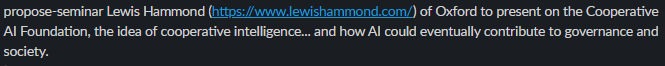
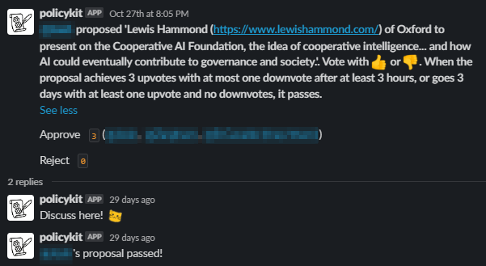

# Proposing a Metagov Seminar

The Metagovernance Seminar is planned through the #seminar-planning channel on the Metagov Slack.&#x20;

Users of the Metagov Slack can propose guest speakers, or a presentation that they would like to give at a seminar.&#x20;

To propose a seminar session, we use the PolicyKit bot command `propose-seminar` to trigger a vote.&#x20;

For example:&#x20;

<figure><figcaption>
Original post to trigger PolicyKit vote
</figcaption></figure>

<figure><figcaption>
Triggered PolicyKit vote
</figcaption></figure>

See [joining-the-metagov-community](../../../community-overview/joining-the-metagov-community/ "mention") for information on how to participate in the Metagov Slack.
